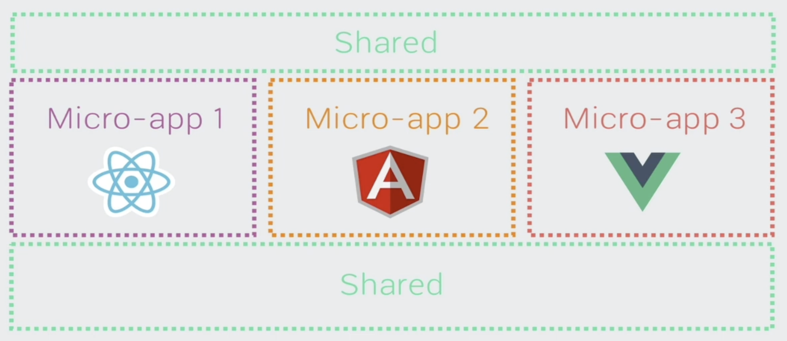
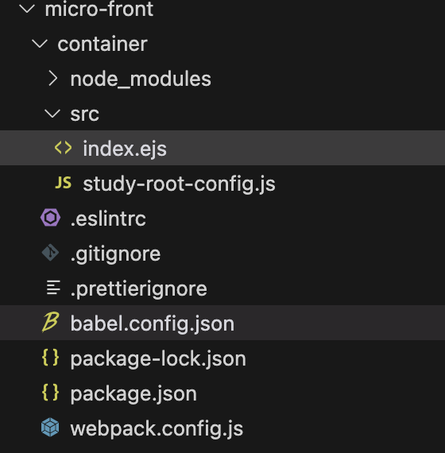
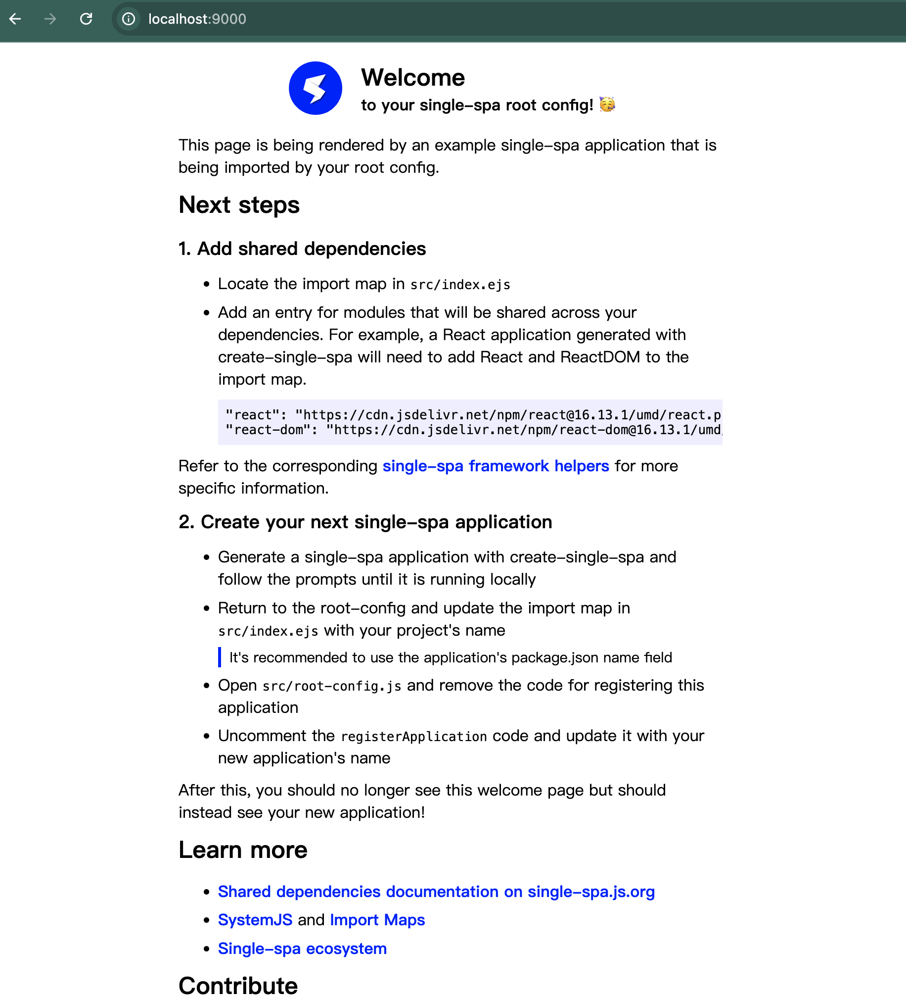

# 基于single-spa和systemjs搭建微前端架构

## 一、什么是微前端
`微前端是一种软件架构，可以把前端应用拆解成一些更小的能够独立开发部署的微型应用，然后再将这些应用进行组合使其成为整体应用的架构模式`

`微前端架构类似于组件架构，但不同的是，组件不能独立构件和发布，但是微前端中的应用是可以的`

`微前端架构与框架无关，每个微应用都可以使用不同的框架`




## 二、价值

### 1、`增量迁移`  
    兼容历史，增量开发
### 2、 `独立发布`  
    单独的模块独立发布即可
### 3、`允许单个团队做出决策`   
    与框架无关

## 三、微前端的问题
### 1、多个微前端如何进行组合

    微前端架构中，除了存在多个微应用之外，还存在一个容器应用，每个微应用都需要被注册到容器应用中。

    微前端中的每个应用在浏览器中都是一个独立的JavaScript模块，通过模块化的方式被容器应用启动和运行。

    使用模块化的方式运行应用可以防止不同的微应用在同时运行时发生冲突

### 2、微前端中如何实现路由
    在微前端架构中，当路由发生变化时，容器应用首先会拦截路由的变化，根据路由匹配微前端应用，当匹配到微应用以后，再启动微应用路由，匹配具体的页面组件

### 3、微应用与微应用之间如何实现状态共享
    在微应用中，通过发布订阅模式实现状态共享，如何rxjs

### 4、微应用与微应用之间如何实现框架和库的共享
    通过import-map和webpack中的externals属性

# 四、Systemjs
**systemjs是一个用于实现模块化的js库，有属于自己的模块化规范**  

`在微前端架构中，微应用被打包为模块，但浏览器不支持模块化，需要使用systemjs实现浏览器中的模块化`

`在开发阶段我们可以使用es模块规范，然后使用webpack将其转换为systemjs支持的模块`

## 4.1 systemjs-demo1
**案例：通过webpack将react应用打包为systemjs模块，在通过systemjs在浏览器中加载模块**

**重点：**
1、webpack，output的libraryTarget: 'system'
2、externals，使用公共库
3、new HtmlWebpackPlugin，inject不希望把js注入到html中
4、script脚本设置type为systemjs-importmap，引入react、react-dom库
5、最后System.import引入


# 五、single-spa
`实现微前端架构的框架`
```js
    在single-spa框架中有三种类型的微前端应用：

        1、single-spa-application/parcel：微前端架构中的微应用，可以使用vue、react、angular等框架（parcel共享ui组件，用于头部、侧边栏、application应用于不同微应用）

        2、single-spa root config：创建微前端容器应用，通过容器应用来加载和管理普通的应用

        3、utility modules：公共模块应用，非渲染组件，用于跨应用共享js逻辑的微应用

```

# 六、创建容器应用

## 6、1 安装single-spa脚手架工具
    `npm install create-single-spa@2.0.3`

## 6、2 创建微前端应用目录
    `mkdir workspace && cd $_`

## 6、3 创建微前端容器应用
    create-single-spa:  
        应用文件夹填写 container
        应用选择 single-spa root config
        组织名称写study



## 6、4 启用和访问 localhost:9000


## 6、5 single-spa注意事项  
```js
    registerApplication({
        name: "@single-spa/welcome",
        app: () =>
            System.import(
            "https://unpkg.com/single-spa-welcome/dist/single-spa-welcome.js"
            ),
        activeWhen: ["/"],
    });

    /**
     * 
     * name：字符串类型，微前端应用名称，“@组织名称/应用名称”
     * app：函数类型，返回Promise，通过systemjs引用打包好的微前端应用模块代码（umd）
     * activeWhen：路由匹配时激活应用
     * 
     */


    // start方法必须在single-spa的配置文件中调用
    // 在调用start之前，应用会被加载，但不会初始化，挂载或卸载
    start({
        // 这个属性事，是否可以通过history.pushState()和history.replaceState（）更改出发single-spa路由，true是不允许，false是允许
        urlRerouteOnly: true,
    });


```


## 加载普通应用，不基于框架的应用

/FIXME:webpack-config-single-spa:4.0.0

## 路由只对相应的应用生效

## 加载react应用

## 加载vue应用

## FIXME:amd格式】


## 全局状态下发

## 通信
    eventEmitter

## 样式隔离

## 版本更新推送

## 